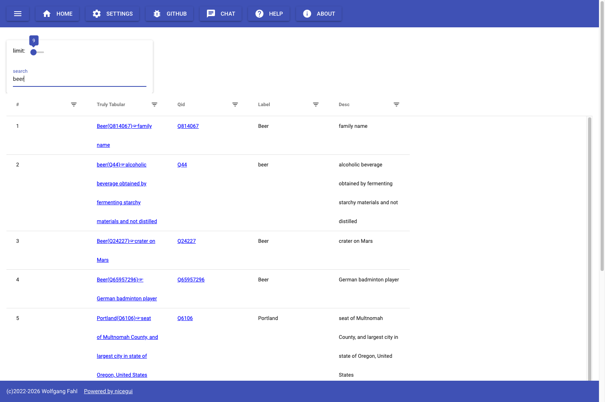
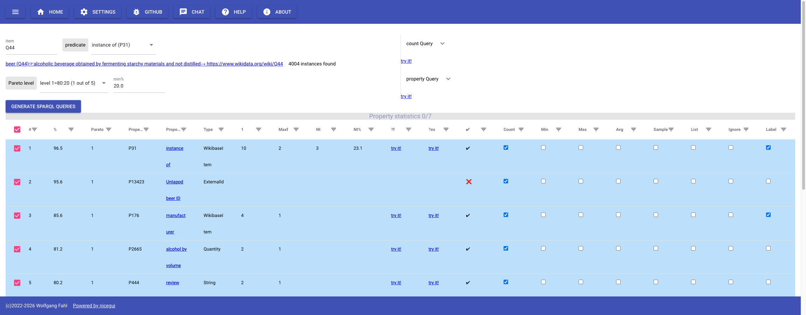
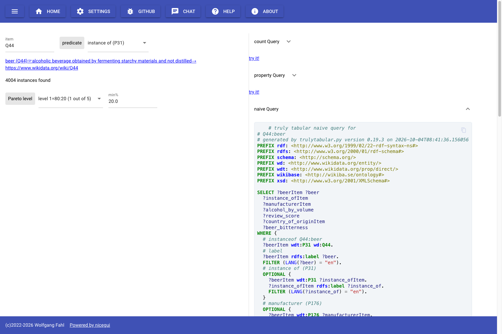

# wdgrid
nicegui based wikidata grid and sync

| | |
| :--- | :--- |
| **PyPi** | [](https://pypi.python.org/pypi/wdgrid/) [](https://www.apache.org/licenses/LICENSE-2.0) [](https://pypi.org/project/wdgrid/) [](https://pypi.org/project/wdgrid/) [](https://pypi.org/project/wdgrid/) |
| **GitHub** | [](https://github.com/WolfgangFahl/wdgrid/actions/workflows/build.yml) [](https://github.com/WolfgangFahl/wdgrid/releases) [](https://github.com/WolfgangFahl/wdgrid/graphs/contributors) [](https://github.com/WolfgangFahl/wdgrid/commits/) [](https://github.com/WolfgangFahl/wdgrid/issues) [](https://github.com/WolfgangFahl/wdgrid/issues/?q=is%3Aissue+is%3Aclosed) |
| **Code** | [](https://github.com/psf/black) [](https://pycqa.github.io/isort/) [](https://github.com/WolfgangFahl/wdgrid/discussions) |
| **Docs** | [](https://WolfgangFahl.github.io/wdgrid/) [](https://github.com/PyCQA/docformatter) [](https://google.github.io/styleguide/pyguide.html#s3.8-comments-and-docstrings) |
| **Cite** | [](https://doi.org/10.5281/zenodo.20035246) |

[](http://www.bitplan.com)

## What is wdgrid?
wdgrid analyzes how tabular the data of a [Wikidata](https://www.wikidata.org/wiki/Wikidata:Main_Page) class is.
For a class such as [beer (Q44)](https://www.wikidata.org/wiki/Q44) it

* counts the instances of the class
* lists the properties these instances use and the percentage of instances that have a value for each property
* determines per property how many instances have exactly one value and how many have several
* generates SPARQL queries for the selected properties that return one row per instance

## Truly Tabular
Tables expect exactly one value per column in each row. A knowledge graph does not: a property
may be missing for an instance or have several values. A straightforward "naive" SPARQL query
with one `OPTIONAL` clause per property therefore returns more rows than there are instances as soon as
a property has more than one value, and the result is not usable as a table without further work.

The approach is described in

> Wolfgang Fahl, Tim Holzheim, Andrea Westerinen, Christoph Lange, Stefan Decker:
> *Property cardinality analysis to extract truly tabular query results from Wikidata.*
> Wikidata Workshop 2022 at ISWC 2022, CEUR-WS Vol-3262.
> https://ceur-ws.org/Vol-3262/paper7.pdf

The analysis runs in three steps:

1. a count query determines the total number of instances of the class
2. a property query selects the properties used by the instances together with the number of instances that provide a value
3. one query per property reports the cardinality statistics of that property

"Truly tabular" data has a cardinality of 1 in each column. wdgrid is the 2024 frontend for this analysis and
builds the queries that limit the result to such data, see also
[Truly Tabular RDF](https://wiki.bitplan.com/index.php/Truly_Tabular_RDF).

## Demo
* [RWTH Aachen i5](https://wdgrid.wikidata.dbis.rwth-aachen.de/)
* [BITPlan](https://wdgrid.bitplan.com)

## Usage
The example is [beer (Q44)](https://wdgrid.bitplan.com/tt/Q44).

### 1. Search
Enter a search term on the home page. Each hit links to the truly tabular analysis of the item and to its Wikidata page.



### 2. Analyze
The truly tabular page shows the number of instances and the property statistics.

* `predicate` selects how instances are found, e.g. `instance of (P31)` or `instance/subclass of (P31/P279*)`
* `Pareto level` and `min%` set the minimum percentage of instances that must have a value for a property to be listed
* `count Query` and `property Query` show the SPARQL queries behind the numbers with a `try it!` link to the endpoint



### 3. Generate SPARQL queries
Select the properties and aggregates in the table and click `Generate SPARQL queries`.
wdgrid shows a naive query and an aggregate query for the selection.



## Reading the property table
The columns are explained in detail at [Truly Tabular RDF/Info](https://wiki.bitplan.com/index.php/Truly_Tabular_RDF/Info).

| column | meaning |
| :--- | :--- |
| `#` | rank of the property by the percentage of instances with at least one value |
| `%` | percentage of instances with at least one value for the property |
| `pareto` | Pareto level of that percentage: level 1 = 80:20 (1 out of 5), level 2 = 96:4 (1 out of 25), ... |
| `property`, `propertyId`, `type` | the Wikidata property, its id and its Wikibase data type |
| `1` | number of truly tabular entries with a cardinality of 1 |
| `maxf` | maximum cardinality of the property |
| `nt`, `nt%` | number and percentage of non tabular entries with a cardinality > 1 |
| `?f` | `try it!` link to the query for the frequency histogram of the property |
| `?ex` | `try it!` link to examples of non tabular entries |
| `✔` | the statistics for the property have been calculated successfully |
| `count`, `min`, `max`, `avg`, `sample`, `list` | SPARQL aggregate to apply in the generated query, `list` uses `GROUP_CONCAT()` |
| `ignore` | ignore solutions with multiple values for the property |
| `label` | show the label of the property value in the generated query |

## REST API
The truly tabular analysis is available as JSON via `/api/tt/{qid}`.
The Swagger UI is at `/docs` of each demo, e.g. https://wdgrid.bitplan.com/docs

```bash
# instance count and property frequencies of car carrier (Q356847)
curl -s https://wdgrid.bitplan.com/api/tt/Q356847

# ship (Q11446): only properties used by at least 50 % of the instances
curl -s "https://wdgrid.bitplan.com/api/tt/Q11446?min_frequency=50"

# car carrier including the instances of its subclasses
curl -s "https://wdgrid.bitplan.com/api/tt/Q356847?predicate=wdt:P31/wdt:P279*"

# same analysis on the RWTH Aachen i5 demo
curl -s https://wdgrid.wikidata.dbis.rwth-aachen.de/api/tt/Q356847
```

Query parameters: `predicate` (default `wdt:P31`), `lang` (default `en`),
`endpoint` (name of the SPARQL endpoint), `min_frequency` (default `20.0`),
`stats` (default `false`, adds the non tabular statistics with one query per property).

Example answer for `curl -s "https://wdgrid.bitplan.com/api/tt/Q44?min_frequency=95"`:

```json
{
  "qid": "Q44",
  "label": "beer",
  "description": "alcoholic beverage obtained by fermenting starchy materials and not distilled",
  "search_predicate": "wdt:P31",
  "endpoint": "wikidata-qlever",
  "count": 4004,
  "min_frequency": 95.0,
  "properties": [
    {"propertyId": "P31", "property": "instance of", "type": "WikibaseItem", "count": 3865, "%": 96.5, "pareto": 1},
    {"propertyId": "P13423", "property": "Untappd beer ID", "type": "ExternalId", "count": 3829, "%": 95.6, "pareto": 1}
  ]
}
```

## Installation
```bash
pip install wdgrid
# start the webserver on http://localhost:9997
wdgrid -s
# use another SPARQL endpoint
wdgrid -s --endpointName wikidata-main
```
`wdgrid -h` shows all options.

## Cite as

If you use wdgrid in your research, please cite it via its Zenodo concept DOI
(which always resolves to the latest version):

> Fahl, W. *wdgrid — NiceGUI-based Wikidata grid display and sync.*
> Zenodo. https://doi.org/10.5281/zenodo.20035246

Machine-readable metadata is available in [`CITATION.cff`](./CITATION.cff);
GitHub's "Cite this repository" button and Zenodo pick it up automatically.
For a specific release, use the version DOI shown on the corresponding
[Zenodo record](https://doi.org/10.5281/zenodo.20035246).

For the method cite the [Truly Tabular paper](https://ceur-ws.org/Vol-3262/paper7.pdf).

## Links
* [Python](https://www.python.org/)
* [wikidata](https://www.wikidata.org/wiki/Wikidata:Main_Page)
* [wikidata query service](https://query.wikidata.org/)
* [qlever wikidata query service](https://qlever.cs.uni-freiburg.de/wikidata)

## Documentation
[Wiki](http://wiki.bitplan.com/index.php/Wdgrid)
